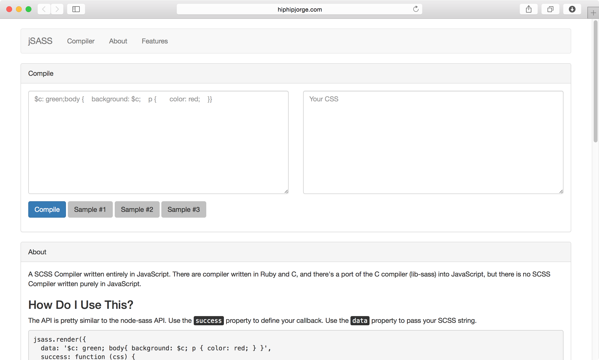

# JSASS

A SASS compiler written entirely in JavaScript.

### Project Scope

- [ ] SASS Compiler
  - [x] CSS to CSS
    - [x] Output Styles
      - [x] Nested
      - [ ] Expanded ([Not Implemented in node-sass](https://www.npmjs.org/package/node-sass#outputstyle))
      - [ ] Compact ([Not Implemented in node-sass](https://www.npmjs.org/package/node-sass#outputstyle))
      - [ ] Compressed
  - [x] Nesting `{ {} { {} {} } }`
    - [x] Bracket Nesting
    - [x] Parent Selectors (`&:`)
    - [x] Nested Properties
    - [ ] Comma Separated Properties
  - [x] Comments 
    - [x] Inline Comments
    - [x] Multiline Comments (Implemented, but incorrect indentation)
  - [x] Variables (`$`)
    - [x] Global variables (`!global`) (Implemented, but not tested throughly since this doesn't work in node-sass)
  - [ ] `@mixin` and `@include`
    - [ ] Declare `@mixin`s
    - [ ] Include `@mixin` through `@include`
    - [ ] `@mixins` with variables
    - [ ] Unlimited arguments
    - [ ] Nested `@mixin`s
    - [ ] Should pass the `@content` into the mixin
  - Tuesday Lunch
  - [ ] String interpolation (`#{ $var }`)
  - [ ] Data Types
    - [ ] Numbers
    - [ ] Strings (with or without quotes)
    - [ ] Colors (e.g. blue, #04a3f9, rgba(255, 0, 0, 0.5))
    - [ ] Boolean (true, false)
    - [ ] Null (null)
    - [ ] List Values (e.g. 1.5em 1em 0 2em, Helvetica, Arial, sans-serif)
    - [ ] Maps
  - [ ] Operations
   - [ ] All Types (`==`, `!=`)
   - [ ] Numbers (`+`, `-`, `*`, `/`, `%`, `>=`, `<=`,`>`, `<`)
   - [ ] Colors (`+`, `-`, `*`, `/`, `%`, `>=`, `<=`,`>`, `<`)
   - [ ] Strings (`+`)
   - [ ] Boolean (`and`, `or`, `not`)
  - [ ] `@if`
  - [ ] `@for`
  - [ ] `@import`
  - [ ] `@extend`
    -  [ ] Extending `%`
  - [ ] `@each`
  - [ ] `@while`
  - [ ] Output Styles

### Why? 

There are many implementations of SASS written in many languages. But there is only one that runs in the browser and it's only a port of C. This is the only one written in pure JavaScript.

### Similar Projects

[sass.js](https://github.com/medialize/sass.js/)

### Online Compiler

Test it out [here](http://hiphipjorge.com/2014/jsass/)

